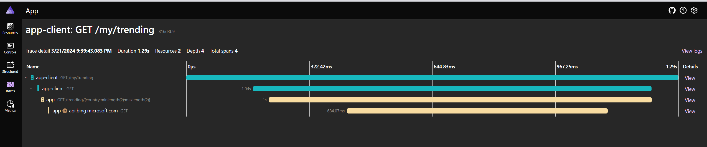

# Kiota + Aspire + .NET 8 Demo

This demo showcases the integration of Kiota, Aspire, and .NET 8! This project demonstrates how these technologies can work together seamlessly.

## Overview

In this demo, we have an application (`App.Client`) that calls our application's API (`App API`). This application integrates with the Bing REST API. The unique aspect of this project is that every HTTP client is automatically generated based on OpenAPI and Kiota.

### Technologies

- Aspire - <https://learn.microsoft.com/en-us/dotnet/aspire/get-started/aspire-overview>
- Kiota - <https://learn.microsoft.com/en-us/openapi/kiota>


## Key Features

- **App.Client**: This is our main application that interacts with the `App API`.
- **App**: This is our application's API which serves as the bridge between `App.Client` and the Bing REST API.
- **Bing REST API Integration**: Our application integrates with the Bing REST API to fetch data.
- **Automatic HTTP Client Generation**: We leverage OpenAPI and Kiota to automate the generation of every HTTP client in our application.

## Components

| Component | Description |
| --- | --- |
| `App` | Integrates with Bing REST API |
| `NewsSearch.Sdk` | Generated OpenAPI HTTP Client by Kiota. It's based on externally provided OpenAPI specification |
| `App.Sdk` | Generated OpenAPI HTTP Client by Kiota |
| `App.Client` | Invokes `App` via App.Sdk |
| `App.Client.Sdk` | Generated OpenAPI HTTP Client by Kiota |
| `App.Client.Cli` | Generated CLI Client by Kiota. Convention based commands based on App.Client OpenAPI specification|
| `App.AppHost` | Aspire Host |
| `App.ServiceDefaults` | Reasonable service defaults provided in 'Aspire' paradigm. |

## Getting Started

Configure `App` and run Aspire AppHost.

```bash
dotnet user-secrets --project ./src/App set ApiKey "<key>"
dotnet run --project ./src/App.AppHost
```

See what `App.Client.CLI` can do.

```bash
$ dotnet run --project ./src/App.Client.Cli/ -- my trending get -h
# Description:

# Usage:
#   App.Client.Cli my trending get [options]

# Options:
#   --output <JSON|NONE|RAW_JSON|TABLE|TEXT>  [default: JSON]
#   --query <query>
#   -?, -h, --help                            Show help and usage information
```

Run:

```bash
$ dotnet run --project ./src/App.Client.Cli/ -- my trending get --output TABLE
# ┌───────────────────────────────────────────────────────────────────────────────────┐
# │ Value                                                                             │
# ├───────────────────────────────────────────────────────────────────────────────────┤
# │ US sues Apple                                                                     │
# │ Sabalenka on Koltsov's death                                                      │
# │ US submits UN draft resolution                                                    │
# │ Biden cancels $6 billion student debt                                             │
# │ Barron Trump's comment                                                            │
# │ Starbucks mugs recalled                                                           │
# │ Milwaukee election official convicted                                             │
# │ February home sales                                                               │
# │ Demi Moore shares tribute to Bruce Willis                                         │
# │ Congress unveils $1.2 trillion funding bill                                       │
# │ Bacteria found in colon cancer                                                    │
# │ Erv Woolsey dies                                                                  │
# │ Georgia executes man for 1993 murder                                              │
# │ Lukas Gage addresses rumors                                                       │
# │ UN resolution on AI                                                               │
# │ Dana Carvey apologizes to Sharon Stone                                            │
# │ `House of the Dragon' trailers                                                    │
# │ Summerfest 2024 lineup                                                            │
# │ Pig's kidney transplanted into a man                                              │
# │ Hayley Erbert, Derek Hough return                                                 │
# │ Airline CEOs seek meeting with Boeing directors                                   │
# │ Russia fires missiles at Kyiv                                                     │
# │ Airlines passengers' personal information review                                  │
# │ Micron stock jumps                                                                │
# │ Rocket Lab launches NRO spy satellites                                            │
# │ Idaho prisoner manhunt day 2                                                      │
# │ US weekly jobless claims                                                          │
# │ Hermès targeted in lawsuit                                                        │
# │ Powerball winning numbers                                                         │
# │ California voters pass Proposition 1                                              │
# │ Beyoncé to receive Innovator Award                                                │
# │ Maren Morris tour dates                                                           │
# │ Meta, Microsoft, X and Match join Epic Games                                      │
# │ Target doubling employee bonuses                                                  │
# │ Kevin Durant NBA career scoring list                                              │
# └───────────────────────────────────────────────────────────────────────────────────┘
```

See the trace:


